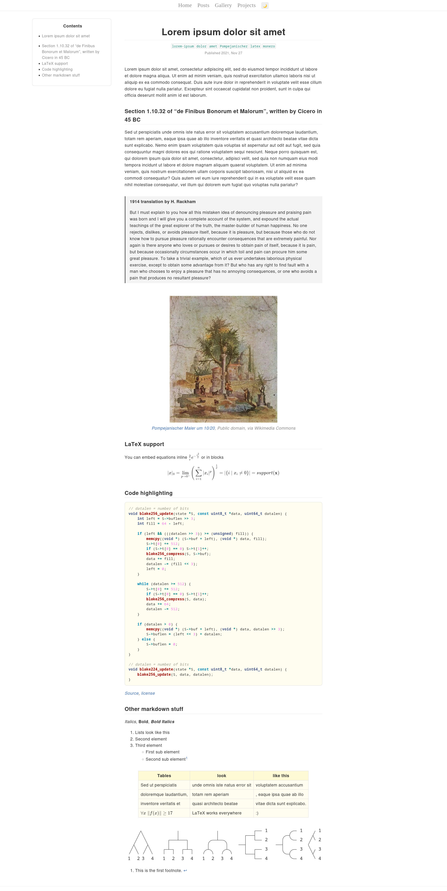

# Succulent

A blog template built with Hugo

## Features

- Tactile and minimalist theme
- Base page size < 64kB, with latex enabled < 450kB
- Responsive design, looks good on Desktop, Laptop, Tablet and Mobile
- Embeds on social media sites like Facebook, Twitter, Slack
- KaTeX to render math equations


## Install

Install [Hugo](https://gohugo.io/). It's available in the official repositories of all the major distributions. On Arch Linux, this would be `sudo pacman -S hugo`. Then clone this repo

```bash
git clone https://github.com/Infinitifall/Succulent
cd Succulent

# serve website locally
hugo server --buildDrafts

# or build the website
hugo
```


## Screenshots




